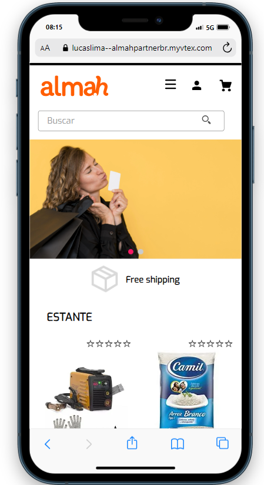
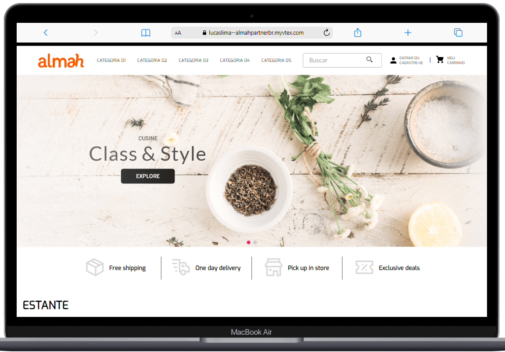

# Test - almahpartnerbr
This project was developed using the VTEX IO platform, with a focus on creating a Home Page adapted for both mobile and desktop devices. The structure was designed to ensure a smooth and optimized user experience across different screen resolutions.

## Installation
1. Clone this repository:

   ```bash
   git clone git@github.com:LuCaSLiMa12/almahProject.git
   cd almahProject
    ```
2. Install dependencies:
   ```bash
   npm install

    ```
3. log in to the platform:
   ```bash
    vtex login almahpartnerbr

    ```
3. create a workspace:
   ```bash
    vtex use myws

    ```
3. run the project:
   ```bash
    vtex link

    ```

The server will be running at https://{your-workspace}--almahpartnerbr.myvtex.com/.

## project
1. Mobile:


2. Desktop:


## Contact

If you have any questions or comments, please contact:

Lucas M. Lima
[](https://www.linkedin.com/in/lucas-lima-ll/)

